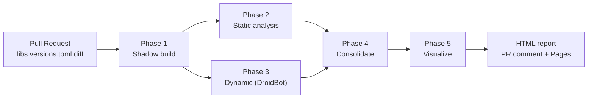

# Pipeline overview



The pipeline runs sequentially on a single host but each phase only depends on artifacts on disk, so a CI matrix can split phases across runners trivially.

## Design principles

1. **JSON on disk, not memory.** Every cross-phase contract is materialised as a Pydantic-validated JSON file. The orchestrator is reproducible from any `phaseN/` directory.
2. **No mocks.** Whenever the pipeline cannot produce real data (APK won't build, DroidBot crashes, emulator unavailable) it emits `BLOCKED` with an explicit `blocked_reason`. The report shows the failure rather than a green hallucination.
3. **Single source of truth for versions.** All bumps go through `gradle/libs.versions.toml`. Direct edits to `build.gradle.kts` are ignored on purpose — the workflow targets the catalog layout that Dependabot uses.
4. **Static and dynamic are complementary.** The static phase produces a *complete but conservative* set of impacted files. The dynamic phase produces a *small but observed* set of impacted screens. The consolidator combines them rather than trying to resolve disagreements.
5. **Thesis-friendly artifacts.** Every intermediate JSON, every Gradle log, every UTG transition graph is preserved and linked from the HTML report. This makes the tool useful for empirical evaluation, not only for code review.

## Inputs

The pipeline only needs three things:

| Input | Where it comes from |
|---|---|
| The KMP project | Local path or a Git checkout. The repo must keep its versions in `gradle/libs.versions.toml`. |
| The bump to analyse | Either explicit (`--dependency`, `--before-version`, `--after-version`) or derived from a `libs.versions.toml` diff. |
| (Optional) Ground truth | A `ground_truth.yml` file for [scenarios](../usage/scenarios.md) and the evaluation suite. |

## Outputs

```text
output/
├── phase1/
│   ├── before/                # shadow copy of the project, BEFORE state
│   ├── after/                 # shadow copy of the project, AFTER state
│   └── manifest.json
├── phase2/
│   ├── impact_graph.json      # files + propagation edges
│   └── symbol_index.json      # cached parse tree
├── phase3/
│   ├── before.utg/            # DroidBot UTG, BEFORE APK
│   ├── after.utg/             # DroidBot UTG, AFTER APK
│   └── ui_regressions.json
├── phase4/
│   └── consolidated.json      # the canonical, contract-validated artifact
├── phase5/
│   ├── impact.cc.json         # CodeCharta: per-bump deltas
│   ├── before.cc.json
│   └── after.cc.json
└── report/
    ├── index.html             # the navigable report
    ├── summary.json
    └── summary.md             # PR-comment ready
```

Every directory above is referenced from the HTML report's *Raw Artifacts* tab.

## Where to read the code

| Concern | Module |
|---|---|
| CLI parsing | `src/kmp_impact_analyzer/cli.py` |
| Top-level orchestration | `src/kmp_impact_analyzer/pipeline.py` |
| Cross-phase models | `src/kmp_impact_analyzer/contracts.py` |
| Shadow build | `src/kmp_impact_analyzer/phase1_shadow/` |
| Static analysis | `src/kmp_impact_analyzer/phase2_static/` |
| DroidBot integration | `src/kmp_impact_analyzer/phase3_dynamic/` |
| Consolidation | `src/kmp_impact_analyzer/phase4_consolidate/` |
| CodeCharta + HTML report | `src/kmp_impact_analyzer/phase5_visualize/`, `src/kmp_impact_analyzer/reporting/` |
