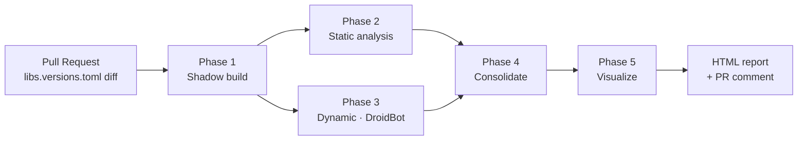

# Pipeline overview



The pipeline runs sequentially on a single host but each phase only depends on artifacts on disk, so a CI matrix can split phases across runners trivially.

## Design principles

1. **JSON on disk, not memory.** Every cross-phase contract is materialised as a Pydantic-validated JSON file. The orchestrator is reproducible from any `phaseN/` directory.
2. **No mocks.** Whenever the pipeline cannot produce real data (APK won't build, DroidBot crashes, emulator unavailable) it emits `BLOCKED` with an explicit `blocked_reason`.
3. **Single source of truth for versions.** All bumps go through `gradle/libs.versions.toml`. Direct edits to `build.gradle.kts` are ignored on purpose — the workflow targets the catalog layout that Dependabot uses.
4. **Static and dynamic are complementary.** Static produces a *complete but conservative* set of impacted files; dynamic produces a *small but observed* set of impacted screens. The consolidator combines them.
5. **Source-set aware.** Impact is reported per source set (`commonMain`, `androidMain`, `iosMain`, …), matching the KMP review model.

## Inputs

| Input | Where it comes from |
|---|---|
| The KMP project | Local path or a Git checkout. Must use `gradle/libs.versions.toml`. |
| The bump to analyse | Explicit (`--dependency`, `--before-version`, `--after-version`) or derived from a catalog diff. |
| (Optional) Ground truth | A `ground_truth.yml` for [scenarios](../guides/scenarios.md). |

## Outputs

```text
output/
├── phase1/
│   ├── before/                # shadow copy of the project, BEFORE state
│   ├── after/                 # shadow copy of the project, AFTER state
│   └── manifest.json
├── phase2/
│   ├── impact_graph.json
│   └── symbol_index.json
├── phase3/
│   ├── before.utg/
│   ├── after.utg/
│   └── ui_regressions.json
├── phase4/
│   └── consolidated.json
├── phase5/
│   ├── impact.cc.json
│   ├── before.cc.json
│   └── after.cc.json
└── report/
    ├── index.html
    ├── summary.json
    └── summary.md
```

## Where to read the code

| Concern | Module |
|---|---|
| CLI parsing | `src/kmp_impact_analyzer/cli.py` |
| Top-level orchestration | `src/kmp_impact_analyzer/pipeline.py` |
| Cross-phase models | `src/kmp_impact_analyzer/contracts.py` |
| Phase modules | `src/kmp_impact_analyzer/phase{1..5}_*/` |
| Reporting | `src/kmp_impact_analyzer/reporting/` |
