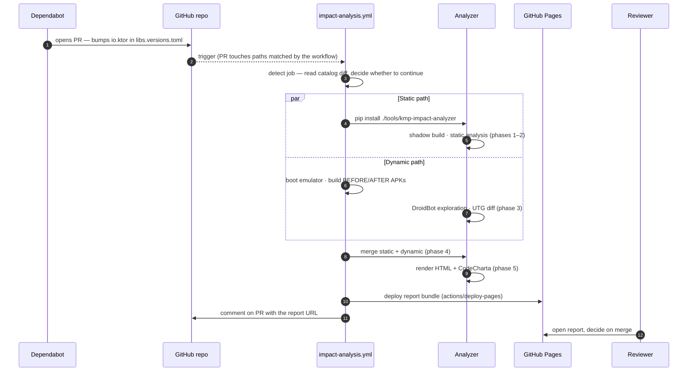

# How Dependabot, the workflow, and the analyzer talk to each other

When everything is wired up correctly, a maintainer never invokes KMP-IMPACT by hand. Dependabot opens the PR, the GitHub Actions workflow runs the pipeline, the report lands on GitHub Pages, and a bot comment points the reviewer at it. This page walks through that flow step by step so you know what to look for when something goes off-script.

<div class="kmp-callout" markdown>
**TL;DR.** Dependabot writes a new version to `gradle/libs.versions.toml`, the workflow notices because of a `paths:` filter, the workflow installs the analyzer from `tools/kmp-impact-analyzer/`, the analyzer reads the diff, the workflow uploads the rendered report to Pages, and the workflow writes the URL back into a PR comment.
</div>

## The actors

| Actor | Where it lives | What it does |
|---|---|---|
| **Dependabot** | GitHub-managed, configured via `.github/dependabot.yml` | Scans `gradle/libs.versions.toml` on a schedule; opens a PR whenever a tracked dependency has a newer version. |
| **`impact-analysis.yml` workflow** | `.github/workflows/impact-analysis.yml` in your repo | Triggers on those PRs, runs the analyzer, publishes the report, comments back. |
| **The analyzer** | Vendored at `tools/kmp-impact-analyzer/` | The Python package that does the actual static + dynamic work. Installed inside each workflow run. |
| **GitHub Pages** | `gh-pages-history` branch + the Pages settings | Hosts the cumulative directory of reports, one per PR run. |
| **Reviewer (you)** | The PR conversation | Reads the bot comment, opens the linked report, decides. |

## End-to-end sequence



Numbered steps in plain English:

1. **Dependabot finds a new version.** On its daily scan, Dependabot finds that `io.ktor` has moved from `2.3.8` to `2.3.11` (or whatever bump). It opens a PR that modifies `gradle/libs.versions.toml`.
2. **GitHub triggers the workflow.** The PR's diff matches the workflow's `paths:` filter (`**/libs.versions.toml`), so GitHub Actions schedules a run.
3. **`detect` reads the diff.** The job runs `kmp-impact detect-version-changes` against the base and head catalogs, exports the affected `dependency_group` / `before_version` / `after_version` to `$GITHUB_OUTPUT`.
4. **Static and dynamic run in parallel.** `static-pipeline` installs the analyzer with `pip install ./tools/kmp-impact-analyzer` and runs phases 1–2. In parallel, `droidbot` boots an Android emulator, builds the BEFORE and AFTER APKs with Gradle, and runs DroidBot against each.
5. **`merge` consolidates.** Static and dynamic artefacts are joined into `phase4/consolidated.json`. The HTML report is rendered.
6. **`deploy-pages` publishes.** The cumulative `gh-pages-history` branch picks up the new report directory under `reports/<dep>/<before>-to-<after>/run-<id>/`. `actions/deploy-pages@v4` makes it live.
7. **The bot comments.** A PR comment is posted with the dependency, the risk label, the source-set breakdown, the report URL, and the raw-artifact link.

## Why the workflow runs in the first place

The trigger contract is the `paths:` filter in the workflow:

```yaml
on:
  pull_request:
    paths:
      - "**/libs.versions.toml"
      - ".github/workflows/impact-analysis.yml"
      - "tools/kmp-impact-analyzer/**"
      - "pipeline/**"
```

Any PR that touches one of these paths schedules a run. Concretely:

- A Dependabot Gradle PR almost always modifies `gradle/libs.versions.toml` — triggers a run.
- A Dependabot pip PR (for ancillary Python tooling) does **not** modify the catalog — the workflow does not run, the PR proceeds without an impact report.
- A maintainer pushing a tweak to the analyzer source under `tools/kmp-impact-analyzer/**` triggers a self-test run.

PRs that don't touch any of those paths never queue the workflow at all — there is no runtime cost.

## What if the same PR has multiple bumps?

`detect` exports the **first** changed entry to the downstream jobs. A PR that bumps two unrelated libraries in the same diff (Dependabot rarely does this, but a manual catalog rebase might) will only generate a report for the first one. The full list is still in the `detect` step's stdout, which you can inspect from the Actions tab.

If you need per-bump reports for a multi-change PR, the cleanest path is to split it — `@dependabot recreate` after rebasing usually produces one PR per library.

## Where do credentials come from?

The workflow uses only the auto-provisioned `${{ secrets.GITHUB_TOKEN }}` for posting comments and pushing the Pages history branch. The analyzer itself reads no secrets — it operates against a checkout of your repository.

You **do** need to grant the workflow the right permissions in `Settings → Actions → General → Workflow permissions`:

| Permission | Value | Used by |
|---|---|---|
| `contents` | `write` | The `deploy-pages` job pushes `gh-pages-history`. |
| `pull-requests` | `write` | The `merge` job posts the PR comment. |
| `pages` | `write` | `actions/deploy-pages` deploys the bundle. |
| `id-token` | `write` | `actions/deploy-pages` signs the deployment. |

The reference workflow already sets these at the top — they exist for documentation here, not as something you need to add manually.

## How does Dependabot know what to bump?

Dependabot itself is GitHub-managed. You configure it via `.github/dependabot.yml`. The analyzer's example config narrows Dependabot's scope to the bumps that keep the pipeline useful — see [Configuring Dependabot](dependabot.md) for the recommended biasing.

If you have never used Dependabot before, the [Dependabot primer](dependabot.md#a-30-second-primer) at the top of the next guide covers the basics.

## What stops the flow?

| Symptom | Where to look |
|---|---|
| The workflow never runs on a Dependabot PR. | The PR didn't modify `gradle/libs.versions.toml`. See [L1](../troubleshooting.md#l1-direct-buildgradlekts-versions-are-not-detected). |
| The workflow runs but skips most jobs. | `detect.outputs.has_changes` is `false` — the diff exists, but Dependabot rewrote unrelated lines in the catalog. Inspect the `detect` step. |
| `static-pipeline` fails on `pip install`. | `tools/kmp-impact-analyzer/` is missing or stale. Re-run the install steps in [Configuring GitHub Actions](github-actions.md). |
| `droidbot` cannot find an Android module. | The module-name autodetection probed `shared, composeApp, androidApp, app, common, kmm-shared, kmpShared` and found none. See [Reference → GitHub Action](../reference/github-action.md#android-module-autodetection). |
| `deploy-pages` cancels. | Concurrent Pages deploys across PRs of the same repo. See [L6](../troubleshooting.md#l6-deploy-pages-cancellation). |

## See also

- [Configuring Dependabot](dependabot.md) — primer + biasing rules.
- [Configuring GitHub Actions](github-actions.md) — three-step installation walkthrough.
- [Diagnosing a BLOCKED phase](diagnosing-blocked.md) — when one of the steps above misbehaves.
- [Reference → GitHub Action](../reference/github-action.md) — every input, output, and permission the workflow uses.
